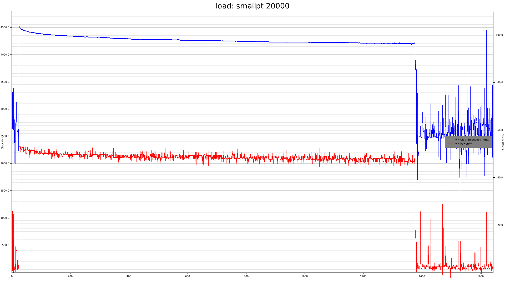
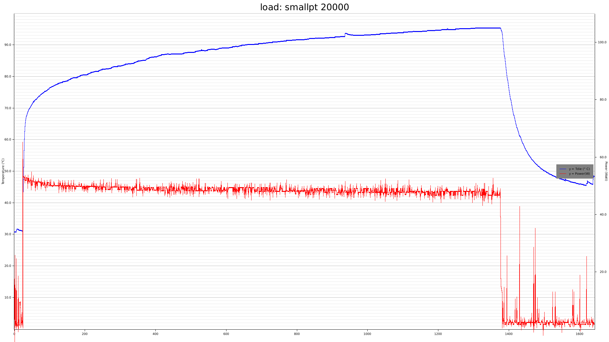

# sense

[](https://github.com/luukvanderduim/sense/actions)
[](https://coveralls.io/github/luukvanderduim/sense?branch=main)

Sense is a small tool to gather data on cpu temperature, power usage and clock frequency and plot graphs during some load.




## Dependencies

Sense is written in Rust. If you wish to try `sense`, you will need to install Rust.
See [the fine rust-lang web page](https://www.rust-lang.org/) for more information on how to install Rust.

Sense depends on [zenpower3](https://github.com/Ta180m/zenpower3) by Anthony Wang.

## Installation

To install you clone the repository:

```Bash
git clone https://github.com/luukvanderduim/sense.git
cd sense
cargo install --path=.
```

## Usage

The intended workflow is:

- start sense
- start workload of interest in another terminal
- stop sense
- profit!

You may want to look at the available command line arguments:

```Bash
sense --help
```

```Bash
Usage: sense [-i <interval>] [-w <write-data>] [-t <title>] [--wxh <wxh>]

Simple tool to sample and plot power consumption, average frequency and cpu die temperatures over time.

Options:
  -i, --interval    optional sample interval in milliseconds (defaults to 1000)
  -w, --write-data  optionally save data series (defaults to `true`)
  -t, --title       optional title (e.g. a condition for the run)
  --wxh             optional image size dimensions WxH (1024x768)
  --help            display usage information
```

Example:

```Bash
sense -i 2000 -t "kernel compilation" --wxh 1920x1080
```

## License

Licensed under either of

- Apache License, Version 2.0
   ([LICENSE-APACHE](LICENSE-APACHE) or <http://www.apache.org/licenses/LICENSE-2.0>)

- MIT license
   ([LICENSE-MIT](LICENSE-MIT) or <http://opensource.org/licenses/MIT>)

at your option.

## Contribution

Unless you explicitly state otherwise, any contribution intentionally submitted
for inclusion in the work by you, as defined in the Apache-2.0 license, shall be
dual licensed as above, without any additional terms or conditions.

See [CONTRIBUTING.md](CONTRIBUTING.md).
